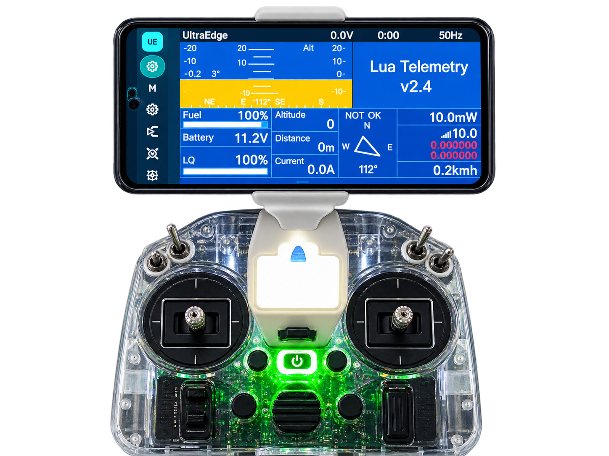
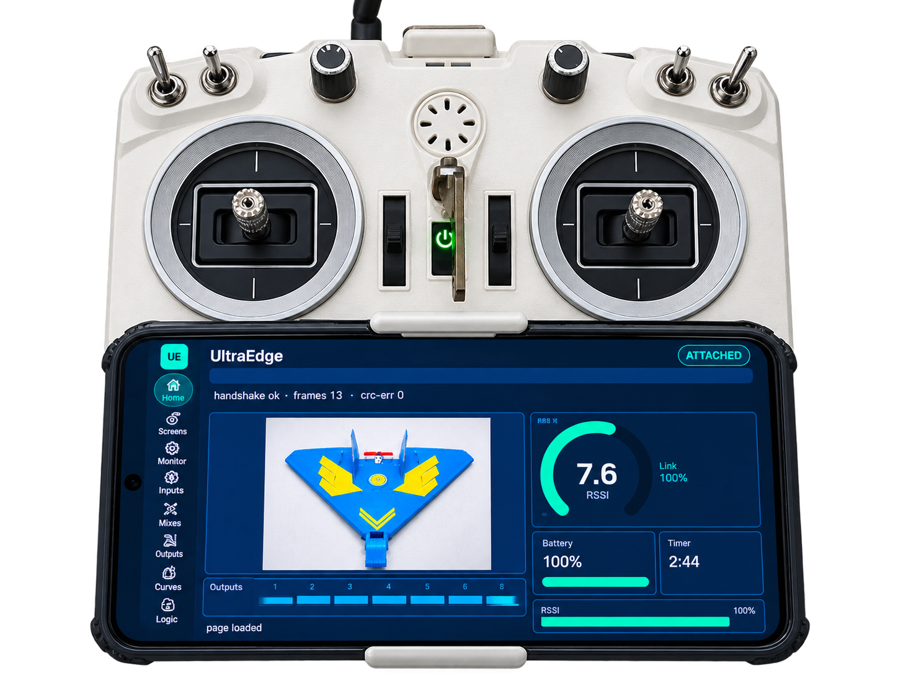

# edgetx-ue — EdgeTX with the UltraEdge companion overlay

**Keep the radio you love in your hands; let the interface, computing and RF evolve around it.**
UltraEdge is building toward a modular radio control system, and this firmware is part of it: it adds the
UltraEdge companion interface to [EdgeTX](https://github.com/EdgeTX/edgetx). It lets compatible companion
software — today, the **UltraEdge** Android app over USB — exchange supported configuration, telemetry and
tool requests, while **real-time control stays on the radio**.

The companion overlay is **dormant until a phone is plugged in**. The companion does not run or schedule
the radio's control loop, and if it is unplugged the radio keeps executing its active model; only companion
display, telemetry, audio and tool sessions are lost. Note that the companion *can* change supported model
and radio settings — those writes are validated and applied by the radio. When the companion is compiled
out, the build is byte-for-byte identical to upstream EdgeTX.

<table>
  <tr>
    <td width="50%"> Home dashboard — live RSSI, battery, timer, model.</td>
    <td width="50%"> Your radio's telemetry/OSD screens on the phone.</td>
  </tr>
</table>

## Get the app / the ecosystem
- 📱 **UltraEdge app (Google Play):** https://play.google.com/store/apps/details?id=com.ultraedge.companion
- 🔌 **UE Protocol** (the open radio↔phone link this firmware speaks): https://github.com/50UR4V/ue-protocol
- 📖 **App home / manual / support:** https://github.com/50UR4V/UltraEdge-app
- 🖨️ **3D-printable phone mounts:** https://github.com/50UR4V/ultraedge-mounts

## Prebuilt firmware (download & flash)
Grab the `.bin` for your radio from **[Releases](../../releases)**, then follow [`FLASHING.md`](FLASHING.md).

| Radio | MCU | Status |
|---|---|---|
| RadioMaster **Pocket** | STM32F407 | ✅ Verified — prebuilt in Releases |
| FrSky **QX7 / QX7 Access** | STM32F205 | ✅ Verified — prebuilt in Releases |
| RadioMaster **TX16S** | STM32F407 (color LCD) | ✅ Verified — prebuilt in Releases |
| RadioMaster **Zorro** | STM32F407xE | ⚠️ **Unverified** prebuilt in Releases (v1.0.2) — flash at your own risk |
| Other radios | — | 🔧 **build it yourself** ([`BUILD-HOWTO.md`](BUILD-HOWTO.md)) |

> TX16S is the first **color-LCD** target verified on hardware. **Zorro** (v1.0.2) is provided as a
> convenience prebuilt but is **not hardware-verified** — flash at your own risk and report back in
> **[Issues](../../issues)**. We mark a radio ✅ Verified only after it's been built **and** checked on real
> hardware; with no phone attached every build flies as stock EdgeTX.
>
> *Known on TX16S (color LCD): telemetry-screen refresh is slower than on mono (tracked). It doesn't
> affect flight.*

## Build it yourself
See **[`BUILD-HOWTO.md`](BUILD-HOWTO.md)** for two paths:
- **GitHub Codespaces** (no local toolchain — build in the browser, based on EdgeTX's own Codespaces flow).
- **Native / local** (macOS Arm toolchain or the EdgeTX Docker image).

Both produce a `.bin` you flash exactly like the prebuilt ones.

## Compatibility
Release v1.0.2 (3 Oct 2026) speaks **UE Protocol v4** and pairs with the **UltraEdge app v1.0.7+**. Firmware and app
negotiate the protocol version at connect; keep them on matching major releases. The v4 specification and reference
codec are public in [UE Protocol](https://github.com/50UR4V/ue-protocol). v1.0.2 adds in-app Lua
tools (e.g. ExpressLRS config) and fixes the input/mix "add" behaviour.

## Where we're heading
These are **future directions — not available today**: a replaceable control-processor daughterboard and
other modular hardware *(future; designed toward long-term serviceability, no release date, no promise of
permanent compatibility)*; opt-in cloud backup, map views and external digital-video display *(future,
exploratory — DJI, Walksnail, OpenIPC and HDZero are research examples, not supported integrations)*.

## Relationship to upstream EdgeTX
UltraEdge builds on what the EdgeTX community has made possible.
This fork tracks a pinned EdgeTX base commit and adds one overlay: a self-contained
`radio/src/thirdparty/ultraedge/` module plus small, `#if defined(USB_COMPANION)`-guarded hooks into
audio, telemetry and USB. We intend to keep rebasing onto EdgeTX and to discuss upstreaming the hooks with
the EdgeTX team. This is a **community project and is not affiliated with or endorsed by EdgeTX or FrSky.**

## License
EdgeTX is licensed **GPL-3.0-or-later**; this fork is a derivative work and is distributed under the **same
GPL-3.0** terms. The complete corresponding source — upstream EdgeTX history plus the UltraEdge overlay
commit — is in this repository. See [`LICENSE`](LICENSE). The UltraEdge app is proprietary and
UE Protocol is open and will remain open source; both are separate from this firmware.
